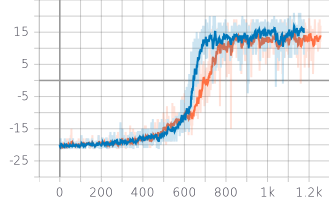
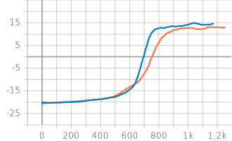
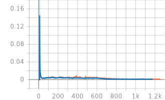

# Learning to play pong through Q-Learning (and Double Q-Learning)

This project was created by Jamshidbek Mirzakhalov for the Deep Learning class at USF.


Easy way to check and validate the results would be to look under */results* folder, it has the final replay buffer for both of the algorithms as well as the logs that you can check out (and visualize) using Tensorboard. 

To reproduce the results and check out the code, follow these part of the code

##  Installing the necessary libraries

There are a few that you might need so I put them all in the requirements.txt file. So, just run:

```
pip install -m requirements.txt
```

## Running the code

If you want to run the code and reproduce the results with the standard Q-Learning algorithm, run this:
```
python train.py --algorithm=q --run_name=baseline

```

If you want to run the same code with Double Q-learning:

```
python train.py --algorithm=dq --run_name=baseline

```

## Watch the bot play (Testing)

You can run the model on a new game by loading the weights into the script. You can do so by running the play.py script:

```
python play.py --model_dir=checkpoints/baseline/weights
```
Or
```
python play.py --model_dir=checkpoints/baseline_dq/weights
```


This will produce a .gif file with the recording of the episode. 


## Results

After  running the experiments with Q learning and Double Q learning, here are some results:

Reward (DQ (Blue) and Q (Orange))
<p align="center">
<kbd>
  
  </kbd>
</p>

Latest 100 reward average (DQ (Blue) and Q (Orange))
<p align="center">
<kbd>
  
  </kbd>
</p>

Model loss (DQ (Blue) and Q (Orange))

<p align="center">
<kbd>
  
  </kbd>
</p>

To visualize these yourself, simply run the tensorboard tool yourself locally:

```
tensorboard --logdir=results

```


